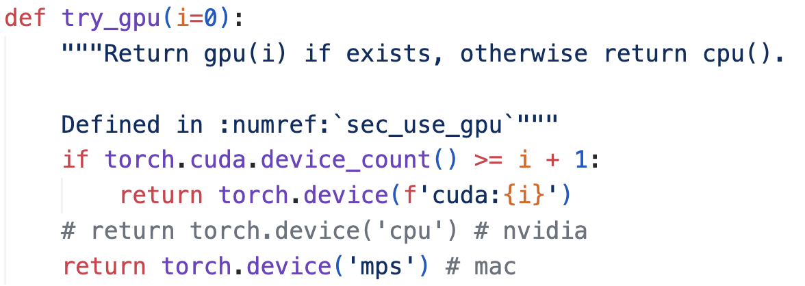

# LimuClass-DL

是李沐深度学习课程的学习记录

## 学习链接

[b站](https://space.bilibili.com/1567748478/channel/seriesdetail?sid=358497) [教材](https://zh.d2l.ai/) [课程信息](https://courses.d2l.ai/zh-v2/)

## 环境要求

- python==3.9
- torch==1.12.0
- torchvision==0.13.0
- d2l==0.17.6
- jupyter

## 显卡

看注释，根据电脑来切换

## info

- 后面的代码尽量别在自己的电脑上跑，也别下数据集，不好上传到github上
- 物体检测(第八章的代码没有很仔细地看)
- 时间有限，从45的SSD视频开始，就没细看代码了，和GNN方向不是很一样
- 所有RNN中
    - H是脑子中的记忆
    - C是日记本上的记忆
    - 得到记忆，都要用到tanh操作
